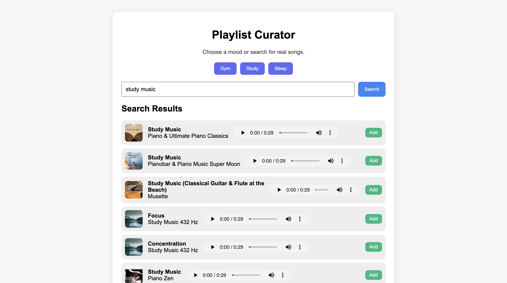
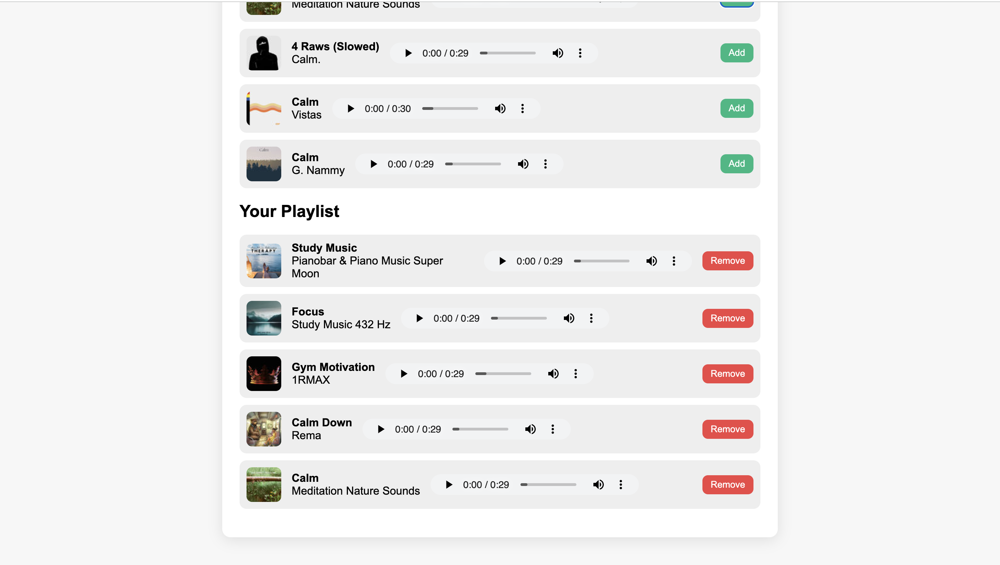

# 🎶 Playlist Curator — Gym, Study, and Sleep

A simple, mood-based playlist generator that uses the Deezer Search API to instantly create playlists for **Gym**, **Study**, or **Sleep**. Users can also search for any artist or song, add tracks to a saved playlist, and play 30-second previews directly in the app. All playlists are stored using `localStorage` so they stay saved even after refreshing the page.

---

## 🚀 Live Demo  
You can try the full project here:  
👉 **https://tanmayi19-jpg.github.io/playlist-curator-api/**

---

## 📸 Screenshots

### **Home Page**


### **Study Mood Results**
Displays songs fetched from the API with album covers, preview audio, and Add buttons.


### **Saved Playlist**
Shows the user’s saved playlist with Remove buttons and audio previews.


---

## 🛠️ Tools Used
- **HTML5** for structure  
- **CSS3** for styling  
- **JavaScript** for logic  
- **Deezer Search API** for real music data (no API key needed)  
- **localStorage** for saving playlists  
- **GitHub Pages** for deployment  
- **VS Code** for coding  
- **Git + GitHub** for version control  

---

## 📦 How to Run the Project Locally

### **Option 1 — Use the Live Site**  
The simplest way — just visit:  
👉 https://tanmayi19-jpg.github.io/playlist-curator-api/

### **Option 2 — Run Locally (with API working)**
1. Clone the repo:
   ```bash
   git clone https://github.com/tanmayi19-jpg/playlist-curator-api.git
 